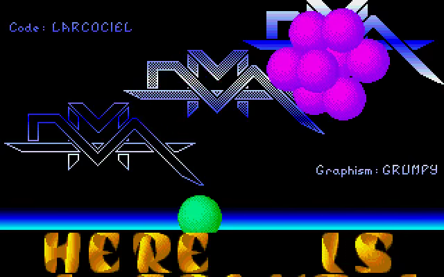
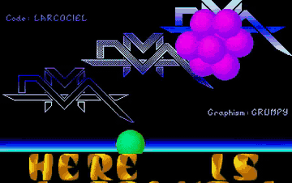

# Larcociel Vectorballs Go

A Go/Ebitengine conversion of **1st Vectorball Demo On The ST**, an Atari ST
intro by **Larcociel of DMA**, using Demo Construction Kit **v1.0.13**.
Graphics are credited to **Grumpy** and music to **David Whittaker**.

<!-- Project showcase -->
## Screenshots

[](docs/media/screenshot-1.png)

Colored vectorballs and layered DMA logos above the golden scroller.

## Video

[](https://github.com/olivierh59500/go-larcociel-vectorball/raw/refs/heads/main/docs/media/preview.mp4)

**[Watch or download the 24-second MP4 preview with sound](https://github.com/olivierh59500/go-larcociel-vectorball/raw/refs/heads/main/docs/media/preview.mp4)**

This preview is captured from the Go production.

The animated image is silent; the MP4 includes the soundtrack.

<!-- End project showcase -->

## Production notes

```sh
go run ./cmd/vectorball
go run ./cmd/vectorball -mute
```

Space or Escape closes the intro. The scene combines the three DMA logos,
sixteen shaded sphere sprites, fourteen authored object sequences, moving
palette bands and the original gold font ribbon. The numeric object frames,
rotation steps, pivots and translation retain the original data. The
rotation and projection use the original signed word arithmetic. Eight-step
palette fades separate object changes; the chip soundtrack and ribbon keep
advancing during the handoff. Simulation uses the Atari ST PAL 50 Hz clock.

DCK supplies retained sprite batches, sound format detection and YM playback.
The artwork and captured original YM6 soundtrack are embedded. Runtime drawing
uses no GPU pixel readback. Native presentation data are separate from Go code.

```sh
go test ./...
go vet ./...
go run ./cmd/vectorball -capture captures/preview -frame 150 -frames 1
go run ./cmd/video
```

The point test compares sixteen original 68000 coordinates and the rotation
state after fifty animation steps. A separate test runs two complete object
cycles. Video export produces a three-minute 640 × 400 H.264/AAC MP4, a PNG
poster and a JSON report in `recordings/`, using DCK's shared graphics/audio
clock. The website uses a VP9/Opus WebM copy.

Original production: [Demozoo](https://demozoo.org/productions/151263/).

## Android

```sh
./scripts/run-android.sh --build-only
./scripts/run-android.sh
```

The build uses Java 17, Android SDK 36, NDK 28.2, Ebitengine 2.9.11 and the
included Gradle wrapper. It produces an ARM64 APK in
`android/app/build/outputs/apk/debug/app-debug.apk`. The host initializes Go
rendering and audio after the Android context is available, preserves landscape
orientation and keeps the screen awake. Android Back closes the activity.
The install command requires one authorized USB device; `ANDROID_SERIAL`
can select a specific device. Build products and machine settings stay local.
